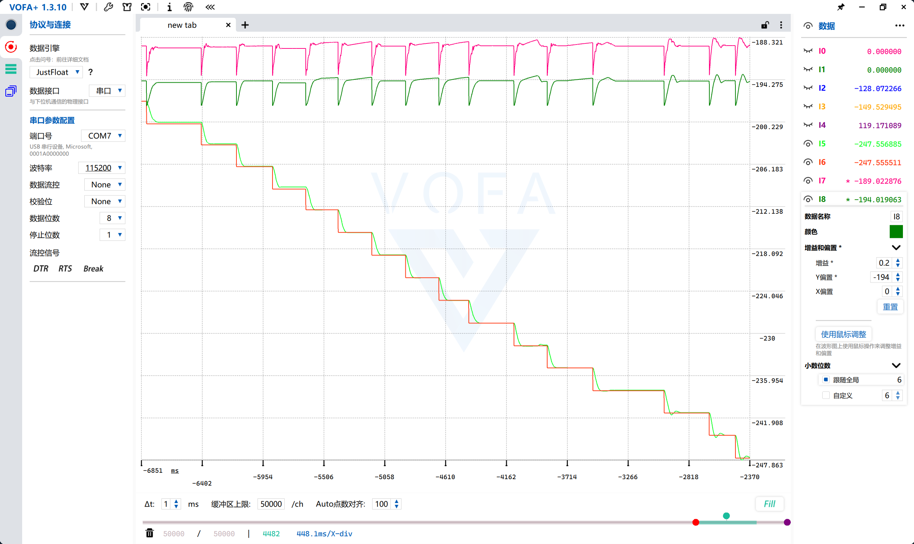

# PID
## 写在前面
理论内容参考必修内容[从不懂到会用！PID从理论到实践~](https://www.bilibili.com/video/BV1B54y1V7hp)

如果你在学习之后还是不能马上上手PID调参，可以参考这份文档。

首先声明，PID调参是一个吃经验的事情，具体操作难以使用语言描述清楚。如果有看不懂的地方请尽情询问 **有调参经验** 的小登和老登。笔者尽量将其写的清楚一些，若有无法理解的点，请反馈。
***
串级PID一般来说一共有**11个参数**，包含 内环/速度环 和 外环/位置环 的 P、I、D、output limit、I output limit，还有滤波系数。

```bash
#define YAW_OUTER_KP 
#define YAW_OUTER_KI
#define YAW_OUTER_KD
#define YAW_OUTER_OUT_LIMIT
#define YAW_OUTER_IOUT_LIMIT
#define YAW_INNER_KP
#define YAW_INNER_KI
#define YAW_INNER_KD
#define YAW_INNER_OUT_LIMIT
#define YAW_INNER_IOUT_LIMIT
#define YAW_INNER_LOWPASS_FILTER_PARA
```

通常来说，P的大小对应数据运动幅度大小，I是微分累计，D用于消抖。

经验告诉我们调车过程中一般很少会加I，D一般都给的很小，P可以给的比较大。低通滤波为1则没开滤波，一般开到0.8就不小了。

重负载的PID会比轻负载**好调很多**，新手建议从**重负载**开始。

如果你的PID参数过于激进，请注意收一收。

**值得注意的是**，PID各个参数的大小是**相对的**。比如3508的 P上限在16000，给到大几千的数据较为正常；而4310的单位为弧度制，P经常给到比较小的十位数甚至个位数。

***
串级PID精细调参可以大致分为**两步**，把脉粗调和vofa精调。

类比于显微镜，找到目标微生物后需要先调节粗准焦螺旋调节合适的距离，然后再使用细准焦螺旋调节清晰度。

**把脉调参**先调节内外环PID到一个合适的范围，再使用**vofa数据**将PID输出数据更加稳定。

但有的电机位置不好，比如串级摩擦轮这些东西，把脉会出现“生命危险”。只能使用vofa调参。

## 古法把脉调参法

这个方法适用于**初步粗调参**。

### 先调内环

1. 将**外环**位置**限制**住

>对应操作：将外环P给极小，再将外环output limit给到极小。如果外环没有限制住会有抖动，不能确定是内环影响还是外环影响。

2. 调节**内环PID**

>对应操作：将内环**除了P以外的数据**清零。然后将P给大，握住转子**延申处**结构（比如：调节车的yaw和pitch轴时，握住枪管；调节拨弹轮时，抓住拨盘）感受电机状态。直至轻轻拨动电机时能感受到一点**将要**轻微抖动的迹象（但没有真正剧烈抖动）。根据实际需求可以选择加一点点D使其更稳定。

### 再调外环

1. 先把output limit放大。

2. 根据经验给点P，直至用手拨拨不动并且抖得不太过分。

3. 加D直至抖动几乎消除。

## Vofa

Vofa使用方法详见[Vofa](Vofa.md)

### 如果你很幸运，调的电机可以用把脉方式先粗调。

那经验告诉我们需要注意的点有：

1. 把**output limit调小**至波形图常见极大值，防止过度变疯。
2. 微调一下P和D

(欢迎补充)

>最好的情况大概如图：


### 如果很不巧，你只能使用vofa调参

建议先复用前辈的PID，然后开vofa细调。

分别打开速度环和位置环的曲线情况，对比实际值和目标值。看谁的数据先出现异常。根据PID原理进行调参。（笔者在这一块经验很少，期待曹汇东学长的补全🌹）