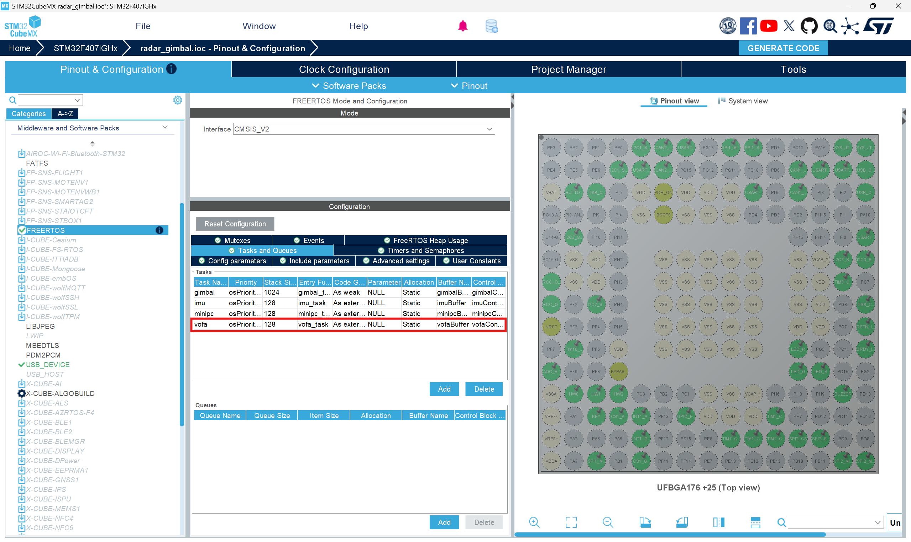
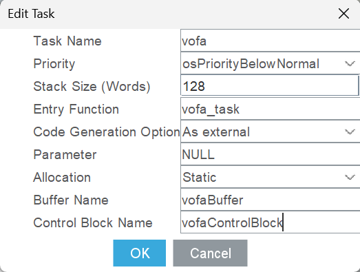

# Vofa
精细调节PID和难以把脉完成的PID需要使用Vofa+进行精细化调参。新手在使用vofa可能会出现一些问题。请阅读此文档。
## 1. Vofa下载
[点击下载vofa](https://je00.github.io/downloads/vofa+_1.3.10_x64_installer.exe)

***
## 2. 添加Vofa配置文件

### 方法一：来自2025届邹绎达古法配置
1. 添加 **Task\src\tsk_vofa.cpp** ,参考模板如下 (摘录自工程2026_radar) ：
```bash
/**
 ******************************************************************************
 * @file           : vofa.cpp
 * @brief          : vofa串口绘图软件数据发送任务
 ******************************************************************************
 * @attention
 *
 * Copyright (c) 2026 GMaster
 * All rights reserved.
 *
 ******************************************************************************
 */
/* Includes ------------------------------------------------------------------*/
#include "crt_gimbal.hpp"
#include "alg_pid.hpp"
#include "usart.h"
#include "FreeRTOS.h"
#include "task.h"
#include <cstdint>

extern CascadePID yawPID;
extern CascadePID pitchPID;

/* Typedef -------------------------------------------------------------------*/

/* Define --------------------------------------------------------------------*/
template <size_t N>
class Vofa
{
private:
    class Frame {
    private:
        static constexpr size_t DATA_FRAME_SIZE = N; // 数据帧大小
        fp32 fdata[DATA_FRAME_SIZE + 1];            // 发送缓冲区（+1用于帧尾）
        uint16_t fPos   = 0;                        //  当前发送缓冲区写入位置

    public:
        Frame() = default;

        bool write(fp32 data)
        {
            if (fPos >= DATA_FRAME_SIZE) {
                return false; // 缓冲区已满
            }
            fdata[fPos++] = data;
            return true;
        }

        const fp32* getData()
        {
            // 添加帧尾
            uint8_t* tail = reinterpret_cast<uint8_t*>(&fdata[fPos]);
            tail[0] = 0x00;
            tail[1] = 0x00;
            tail[2] = 0x80;
            tail[3] = 0x7f;
            return fdata;
        }

        uint16_t getSize() const
        {
            return fPos * sizeof(fp32) + 4;
        }

        void reset()
        {
            fPos = 0;
        }
    } m_frame;

    Gimbal &m_gimbal;

public:
    Vofa(Gimbal &gimbal) : m_gimbal(gimbal) {}

    void gimbalPIDData()
    {
        m_frame.write(yawPID.getOuterLoop().pidGetData().output);
        m_frame.write(pitchPID.getOuterLoop().pidGetData().output);
        m_frame.write(yawPID.getInnerLoop().pidGetData().output);
        m_frame.write(pitchPID.getInnerLoop().pidGetData().output);
        m_frame.write(m_gimbal.getPitchTargetAngle());
        m_frame.write(m_gimbal.getYawTargetAngle());
        m_frame.write(m_gimbal.getIMU()->getGyro().y);
        m_frame.write(m_gimbal.getIMU()->getGyro().z);
    }

    void sendFrame()
    {
        // 通过串口发送数据
        HAL_UART_Transmit_DMA(&huart6, reinterpret_cast<const uint8_t*>(m_frame.getData()), m_frame.getSize());
        m_frame.reset();
    }
};

/* Macro ---------------------------------------------------------------------*/

/* Variables -----------------------------------------------------------------*/
extern Gimbal gimbal;
static Vofa<100> vofa(gimbal); // 使用100个数据帧的Vofa实例
// 如果需要不同大小,可以声明: Vofa<200> vofa_large;

/* Function prototypes -------------------------------------------------------*/

/* User code -----------------------------------------------------------------*/

extern "C" void vofa_task(void *argument)
{
    TickType_t taskLastWakeTime = xTaskGetTickCount(); // 获取任务开始时间
    while (1) {

    #ifdef DEBUG
        // 设置需要发送的数据
        vofa.gimbalPIDData();

        vofa.sendFrame();
    #endif // DEBUG

        vTaskDelayUntil(&taskLastWakeTime, pdMS_TO_TICKS(1)); // 确保任务以定周期1ms运行
    }
}
```

2. 添加 **Chariot\src\crt_vofa.c** ，参考模板如下 (摘录自工程2026_cascade_leg_infantry) ：
```bash
/**
 ******************************************************************************
 * @file           : crt_vofa.c
 * @brief          : vofa串口调试助手
 *                   重定向串口输出到UART6
 ******************************************************************************
 * @attention
 *
 * Copyright (c) 2026 GMaster
 * All rights reserved.
 *
 ******************************************************************************
 */
/* Includes ------------------------------------------------------------------*/
#include <sys/stat.h>
#include <stdlib.h>
#include <unistd.h>
#include <errno.h>
#include <stdio.h>
#include <signal.h>
#include <time.h>
#include <sys/time.h>
#include <sys/times.h>
#include "usart.h"

/* Typedef -------------------------------------------------------------------*/

/* Define --------------------------------------------------------------------*/

/* Macro ---------------------------------------------------------------------*/

/* Variables -----------------------------------------------------------------*/

/* Function prototypes -------------------------------------------------------*/

/* User code -----------------------------------------------------------------*/

/**
 * @brief 重定向printf输出到UART6
 * @param file 文件描述符
 * @param ptr 要发送的数据指针
 * @param len 数据长度
 * @return 实际发送的字节数
 */
int _write(int file, char *ptr, int len)
{
    if (file == STDOUT_FILENO || file == STDERR_FILENO) {
        // 将数据通过UART6发送
        HAL_UART_Transmit(&huart6, (uint8_t *)ptr, len, HAL_MAX_DELAY);
        // HAL_UART_Transmit_DMA(&huart6, (uint8_t *)ptr, len);
        return len;
    }
    return -1;
}
```
注意数据向串口输出到 **UART6**。

3. 在.ioc文件中添加 **freertos进程** ，细节如图：





4. 根目录下的 **Cmakelists** 中加入vofa例程。具体位置在:

```bash
target_sources(${CMAKE_PROJECT_NAME} PRIVATE
    //很多很多例程
    Task/src/tsk_vofa.cpp
)
```
### 方法二： 来自2026届赵辰硕巧思配置
直接在dev文件夹内加入.cpp和.hpp文件:

点击查看[vofa.cpp](dvc_vofa.cpp)

点击查看[vofa.hpp](dvc_vofa.hpp)

配合 **tsk_test.cpp** 使用，只需要调用这里面对应的函数即可使用。（初始化init、写入函数_write）


## 3. 使用vofa
详见[B站vofa教程](https://www.bilibili.com/video/BV1q1421R7uK/?spm_id_from=333.337.search-card.all.click)

一般来说调PID使用 **Justfloat** 即可。

## 4.常见问题
1. 有数据但是不是你要的数据 模式没有选择串口
2. 读不到数据
- 波特率没对齐
- 端口选择错误
- Tx/Rx有没有接反（T对R，R对T）
- vofa传奇bug

    如果你打开串口，确认波特率正确、端口正确、接线Tx/Rx正确……以上所有问题都排查过并确认没有问题

    **你 先 别 急**

    这个是vofa祖传bug

    - 先关闭你的vofa

    - 寻找 **C:\Users\[username]\AppData\Local\vofa+** ,将这个文件夹删掉。
    - 确认这个文件夹中内容删干净之后，再次重启vofa

    请注意，这个vofa可能在任何时间、任何地点、随机概率崩溃。不要怀疑自己也不要怀疑你的电脑，毕竟这个vofa已经很久没更新了。

